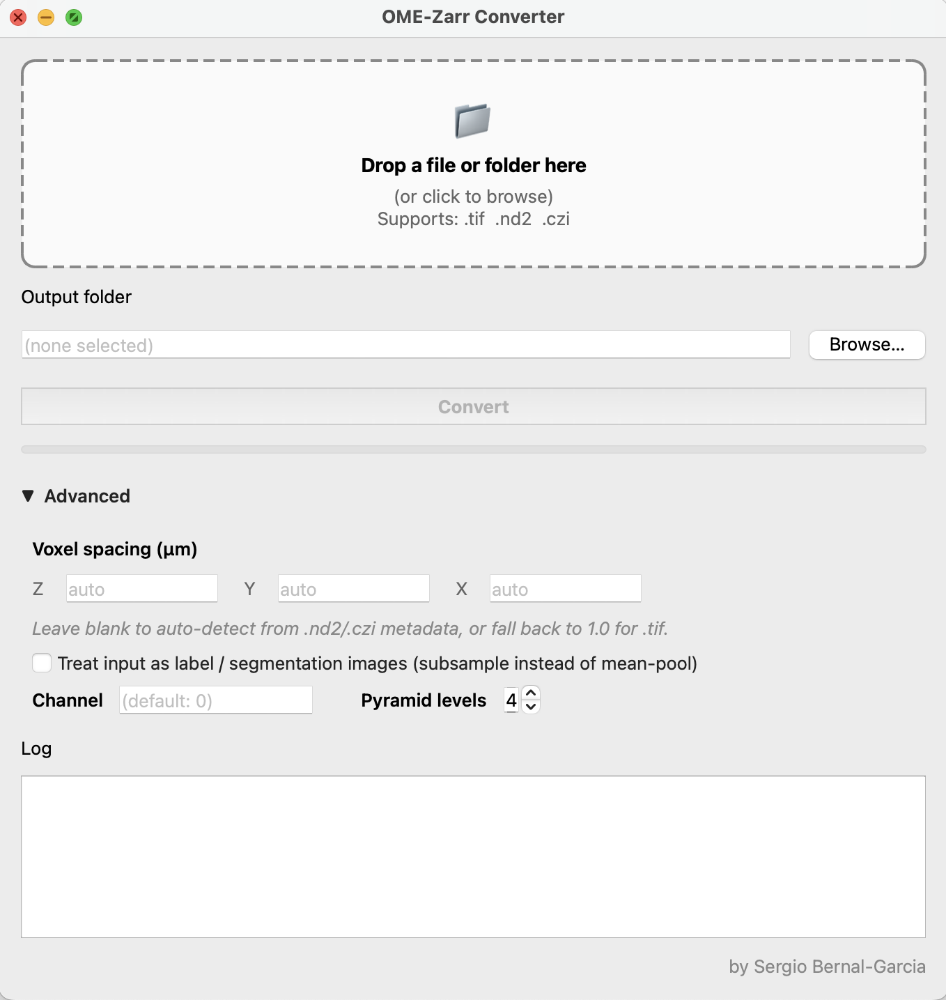

# OME-Zarr Converter

A simple macOS app that converts microscopy images (`.tif`, `.nd2`, `.czi`) to **OME-Zarr** — the open standard for cloud-friendly, multidimensional bioimaging data.

## Download

→ **[Download the latest version](https://github.com/serg-bg/ome-zarr-converter/releases/latest)**

Look under **Assets** for `OME-Zarr-Converter-mac.zip`. Double-click to unzip, then drag `OME-Zarr Converter.app` into your **Applications** folder.

## First launch (one-time)

macOS may block the app the first time because it isn't signed by a paid Apple Developer ID:

1. Right-click `OME-Zarr Converter.app` → **Open**
2. Click **Open** in the warning dialog
3. From now on, double-click works normally

## How to use

1. **Drag** a `.tif`, `.nd2`, or `.czi` file (or a folder of them) into the window
2. Pick (or accept) an **Output folder**
3. Click **Convert**

When conversion finishes, each file gets a row in the **Results** panel.

### Advanced options

Click **▶ Advanced** to set:

- **Voxel spacing (µm)** — auto-detected from `.nd2` / `.czi` metadata; falls back to `1.0` µm for `.tif` if you leave it blank
- **Treat input as labels / segmentation** — uses subsampling instead of mean-pooling when building the pyramid (preserves integer label IDs)
- **Channel** — pick a single channel from a multi-channel file (default: 0)
- **Pyramid levels** — how many resolution levels to generate (default: 4)

## Viewing in napari (optional)

The app can launch [napari](https://napari.org) on the converted file.

**First time only:** click **⚠ Install napari (first time only)** in the Results panel. A Terminal window opens and installs napari with [`uv`](https://github.com/astral-sh/uv). Wait for it to print `napari installed` and then close the window.

After that, the **Open in napari** button next to each result launches a separate napari window:

- The image opens in **2D**. Scroll to navigate slices. Zoom in to fetch higher-resolution tiles automatically (multiscale).
- Click the **cube icon** at the bottom-left of napari to switch to **3D volume** view.
- The **3D volume resolution** dropdown in the converter controls which pyramid level the 3D view uses. *Full res* is sharpest but heaviest; *Half / Quarter / Eighth* are progressively lighter for snappier rotation.

## System requirements

- macOS 12 or later (Apple Silicon or Intel)
- ~250 MB free disk space for the app
- Internet connection on first napari install

## License

[PolyForm Noncommercial 1.0.0](LICENSE) — free for academic, research, personal, and educational use. Commercial use requires a separate agreement; please contact the author.

## Author

Sergio Bernal-Garcia
